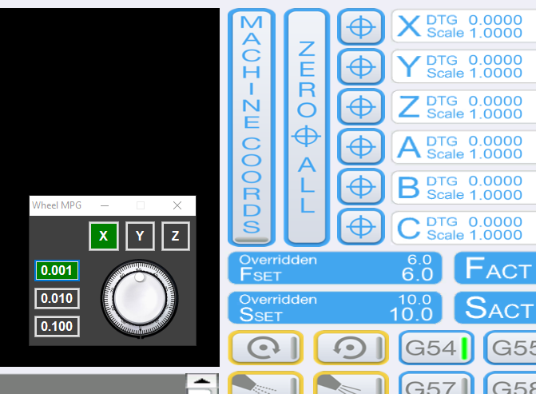

# UCCNCMouseWheelMPG

This is a plugin for UCCNC Motion Control Software that allows you to control X, Y and Z axes using your mouse wheel.

Use config page to set your feed rate and units.

## WARNING:

The author holds no responsibility for any damage, injury or harm caused by use or misuse of this software product.
This software may or may not have been tested. Use it at your own risk.
Software is shipped AS-IS



## Installation

Grab the latest copy of the MouseMPG.dll here:
[Releases](https://github.com/swindex/UCCNCMouseWheelMPG/releases/)
... drop it into ```C:\UCCNC\Plugins``` directory and enable it/check for startup in UCCNC Plugin config


## Contributing

Yes, it is in god-awful vb.net that no self-respecting software developer wants to use.
So. Pull requests are welcome!
