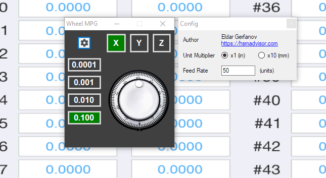

# UCCNCMouseWheelMPG

This is a plugin for UCCNC Motion Control Software that allows you to control X, Y and X axes using your mouse wheel.

## WARNING:

The author holds no responsibility for any damage, injury or harm caused by use or misuse of this software product.
Software is shipped AS-IS



## Installation

Grab the latest copy of the MouseMPG.dll here:
[Releases](https://github.com/swindex/UCCNCMouseWheelMPG/releases/)
... drop it into ```C:\UCCNC\Plugins``` directory and enable it/check for startup in UCCNC Plugin config


## Contributing

Pull requests are welcome
